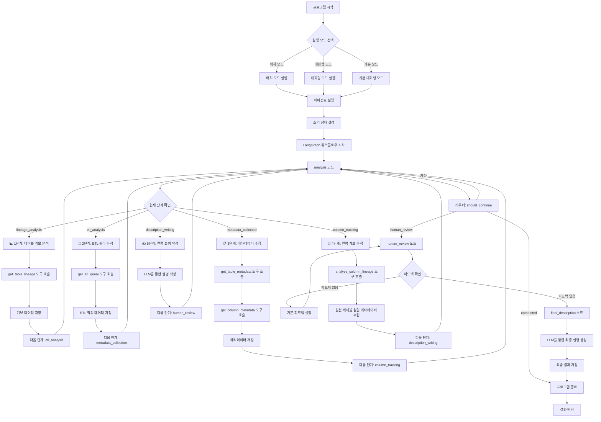
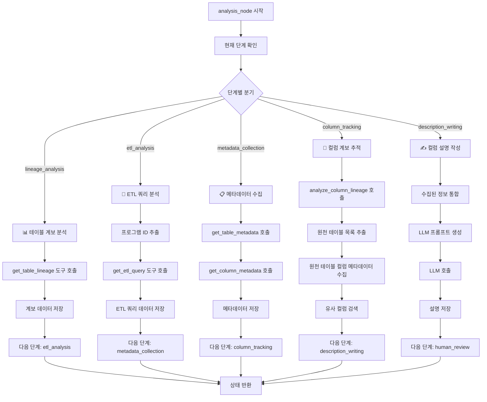
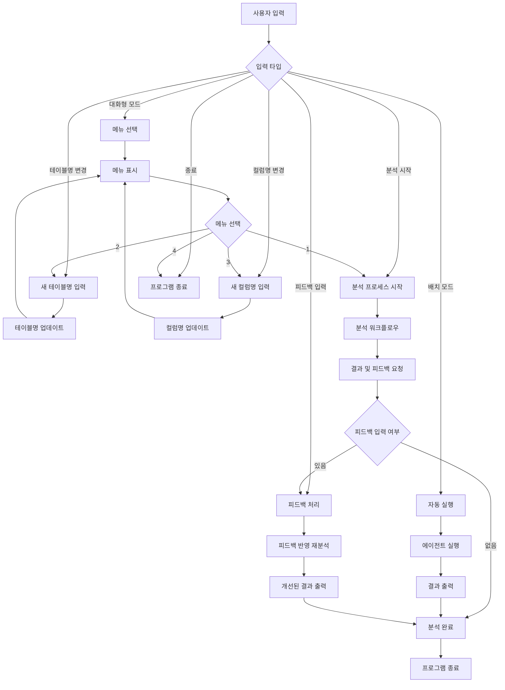
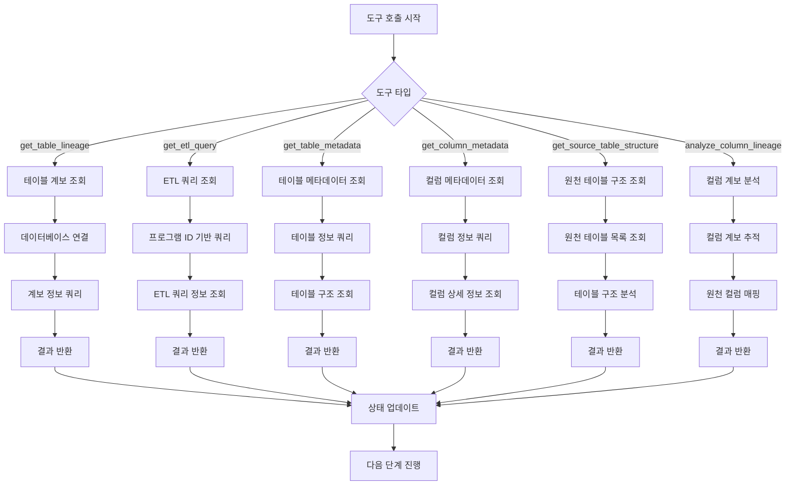
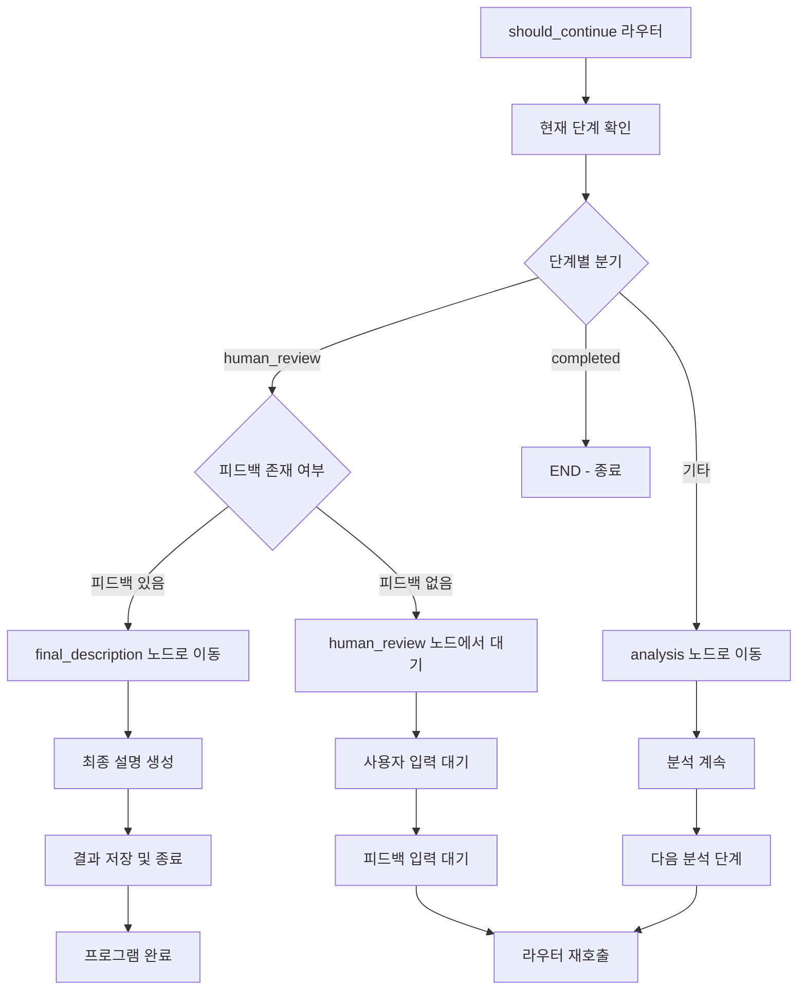

# 컬럼 설명 작성 에이전트 플로우 다이어그램

## 전체 시스템 플로우



## 상세 분석 노드 플로우



## 사용자 상호작용 플로우



## 도구 호출 플로우



## 라우터 로직 플로우



## 전체 시스템 아키텍처

```mermaid
graph TB
    subgraph "사용자 인터페이스"
        A[main.py]
        B[run_agent.sh]
    end
    
    subgraph "에이전트 엔진"
        C[agent.py]
        D[LangGraph 워크플로우]
        E[LLM (GPT-4o-mini)]
    end
    
    subgraph "도구 모듈"
        F[tools.py]
        G[데이터베이스 연결]
    end
    
    subgraph "설정 및 유틸리티"
        H[config.py]
        I[database.py]
    end
    
    subgraph "데이터 소스"
        J[MySQL 데이터베이스]
        K[테이블 메타데이터]
        L[ETL 쿼리 정보]
    end
    
    A --> C
    B --> A
    C --> D
    D --> E
    D --> F
    F --> G
    G --> I
    I --> H
    I --> J
    J --> K
    J --> L
```

이 다이어그램들은 컬럼 설명 작성 에이전트의 전체적인 플로우와 각 구성 요소 간의 상호작용을 보여줍니다.
